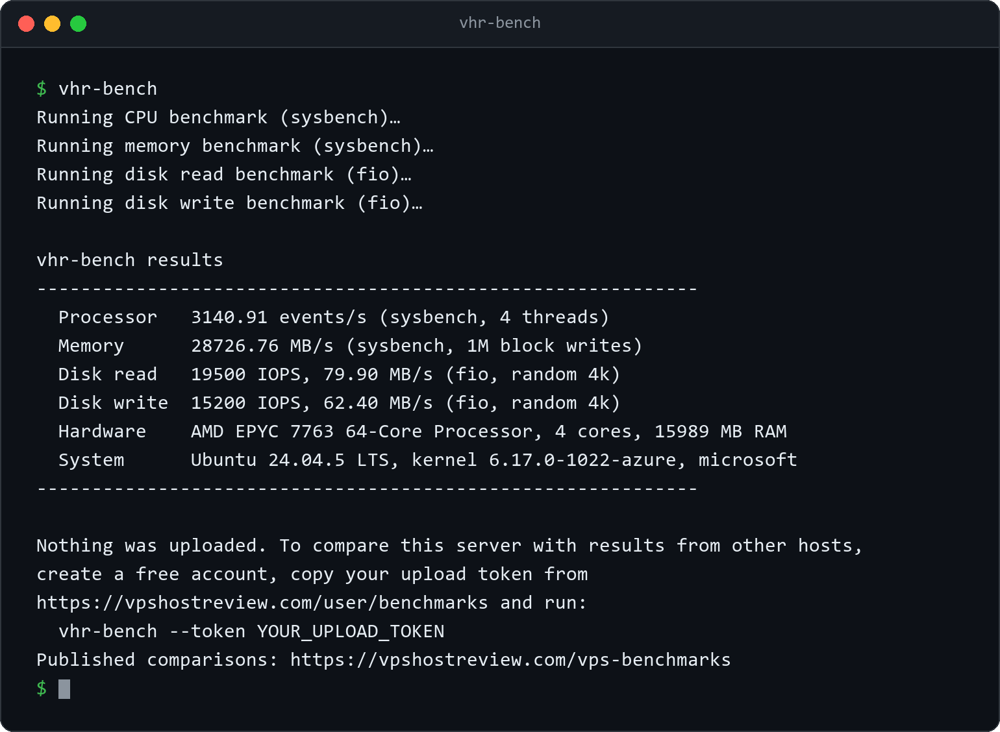

# vhr-bench: VPS Host Review benchmark tool

A free, open-source command-line tool that measures the real performance of any Linux VPS.
It tests the processor, memory, and disk and prints the results. No account is needed.

If you want to compare your server with other people's, you can optionally upload the
result to your [VPS Host Review](https://vpshostreview.com) account. A result is published
through your review of the host you measured: the tool prints the link to that review form
after the upload, and submitting the review attaches the result to it.

**Read the source before you run it.** The tool is a single, readable Bash script:
[`vhr-bench`](./vhr-bench). Without a token it sends nothing anywhere. With one, it prints
the exact JSON it will send and asks for your confirmation before anything leaves your
server.

## What it measures

| Area | Tool | Metric |
|---|---|---|
| Processor | `sysbench cpu` | events per second |
| Memory | `sysbench memory` | MB/s throughput |
| Disk | `fio` (random 4k) | read/write IOPS and MB/s |

It also records basic hardware context (processor model, core count, total memory,
distribution, kernel, and virtualization type) so results are comparable.

## What is NOT sent

Your hostname, IP address, file contents, and credentials are never collected or sent.
Results upload to your account and stay private until **you** choose to attach one to a
review, which is the only way it becomes part of the public provider comparison.

## How results are validated and shown

A benchmark that fails on your server is shown as "not measured", and a run with any reading
missing uploads nothing, so a partial result never reaches the comparison.
Physically impossible results (values far beyond real hardware) are rejected by the server,
so a lightly edited script cannot post absurd numbers. Published figures are medians, and a
provider's comparison appears only once it has several independent benchmarks, so a single
result never defines a provider's numbers. Results are community-submitted and are not
independently verified.

## Install

Review [`install.sh`](./install.sh) first, then:

```bash
curl -fsSL https://github.com/vpshostreview/vhr-vps-benchmark/releases/latest/download/install.sh | sudo bash
```

For supply-chain safety, prefer a pinned release tag over `main`, and verify the published
`sha256` checksum of `vhr-bench` after download:

```bash
sha256sum /usr/local/bin/vhr-bench
```

## Run

```bash
vhr-bench
```

The results print on screen when the run finishes, in about a minute. Nothing is uploaded.



Output from a real run on a 4-core GitHub Actions runner.

To upload a result as well, get your personal upload token from
<https://vpshostreview.com/user/benchmarks>, then:

```bash
vhr-bench --token YOUR_UPLOAD_TOKEN
```

Options:

| Flag | Purpose |
|---|---|
| `--token TOKEN` | Upload the result to your account (or set `VHR_BENCHMARK_TOKEN`) |
| `--api-url URL` | Override the submit endpoint (for local testing) |
| `-y`, `--yes` | Skip the install and upload confirmations |
| `-h`, `--help` | Show help |

## Uninstall

Remove the tool, and optionally the benchmark packages it installed:

```bash
curl -fsSL https://github.com/vpshostreview/vhr-vps-benchmark/releases/latest/download/uninstall.sh | sudo bash
```

This removes `/usr/local/bin/vhr-bench` and offers to remove `sysbench` and `fio`. It does
not remove `curl`, which is a core system utility. Pass `--keep-packages` to remove only the
tool, or `--remove-curl` if you are certain you want curl gone as well.

## Requirements

Linux with one of: `apt-get`, `dnf`, `yum`, `zypper`, or `apk`. The tool installs
`sysbench`, `fio`, and `curl` on first run if they are missing. These upstream tools remain
under their own licenses; this project only invokes them and does not redistribute them.

## License

MIT. See [LICENSE](./LICENSE).
