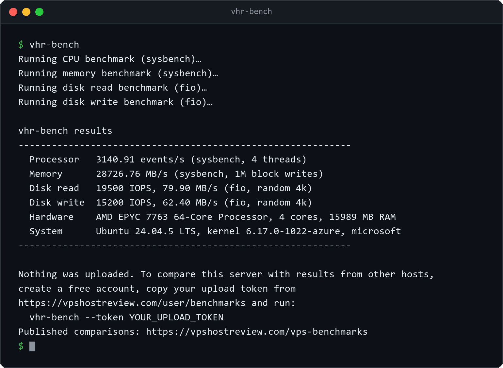

# vhr-bench: VPS Host Review benchmark tool

A free, open-source command-line tool that measures the real performance of any Linux VPS.
It tests the processor, memory, and disk and prints the results. No account is needed.

If you want to compare your server with other people's, you can optionally upload the
result to your [VPS Host Review](https://vpshostreview.com) account. A result is published
through your review of the host you measured: the tool prints the link to that review form
after the upload, and submitting the review attaches the result to it.

**Read the source before you run it.** The tool is a single, readable Bash script:
[`vhr-bench`](./vhr-bench). Without a token it sends nothing anywhere. With one, it prints
the exact JSON it will send and asks for your confirmation before anything leaves your
server.

## Run it once

One command runs the benchmark without installing vhr-bench:

```bash
curl -fsSL https://github.com/vpshostreview/vhr-vps-benchmark/releases/latest/download/vhr-bench | bash -s -- --cleanup
```

To upload the result to your account as well, add your upload token from
<https://vpshostreview.com/user/benchmarks>:

```bash
curl -fsSL https://github.com/vpshostreview/vhr-vps-benchmark/releases/latest/download/vhr-bench | bash -s -- --cleanup --token YOUR_UPLOAD_TOKEN
```

What it does:

- The script goes straight from `curl` into `bash`, so vhr-bench itself is never saved on
  your server. The only files it writes itself are fio's test files and a copy of the
  package manager's output, in a temporary directory under `/var/tmp` that it deletes when
  the run ends. It uses `/var/tmp` rather than `/tmp` because `/tmp` is often held in
  memory, and fio would then measure memory instead of the disk. If the directory turns
  out to be in memory anyway, the disk is reported as not measured.
- If `sysbench` or `fio` is missing, it asks before installing them with your package
  manager.
- When the run ends, whether it finishes, fails partway, is stopped with Ctrl+C, or loses
  its terminal or SSH session, `--cleanup` removes the packages this run installed, and
  only those. Packages that were installed before the run stay, and so does anything
  another program installed while it ran. If it cannot tell for certain which packages it
  installed, it removes none and prints what it left and the command that removes the
  benchmark tools.
- Installing packages needs root. Run it as root, or as a user who can use `sudo`: it
  calls sudo only when it is not already running as root.

The cleanup removes packages; it does not undo everything a package manager does. Package
lists refreshed by `apt-get update` stay refreshed, an existing package upgraded to satisfy
a dependency stays upgraded, a new package that took the place of one you already had
stays (removing it would leave neither), a signing key the package manager imported to
check the packages stays, and your package manager may keep its own copy of what it
downloaded in its cache, as it does for any install. Nothing can run after `kill -9` or a
power cut, so a run stopped that way removes nothing.

To run the benchmark regularly, install it instead.

## What it measures

| Area | Tool | Metric |
|---|---|---|
| Processor | `sysbench cpu` | events per second |
| Memory | `sysbench memory` | MB/s throughput |
| Disk | `fio` (random 4k) | read/write IOPS and MB/s |

It also records basic hardware context (processor model, core count, total memory,
distribution, kernel, and virtualization type) so results are comparable.

## What is NOT sent

Your hostname, IP address, file contents, and credentials are never collected or sent.
Results upload to your account and stay private until **you** choose to attach one to a
review, which is the only way it becomes part of the public provider comparison.

## How results are validated and shown

A benchmark that fails on your server is shown as "not measured", and a run with any reading
missing uploads nothing, so a partial result never reaches the comparison.
Physically impossible results (values far beyond real hardware) are rejected by the server,
so a lightly edited script cannot post absurd numbers. Published figures are medians, and a
provider's comparison appears only once it has several independent benchmarks, so a single
result never defines a provider's numbers. Results are community-submitted and are not
independently verified.

## Install

Review [`install.sh`](./install.sh) first, then:

```bash
curl -fsSL https://github.com/vpshostreview/vhr-vps-benchmark/releases/latest/download/install.sh | sudo bash
```

It installs the `vhr-bench` attached to the latest release. To install a particular
release instead, name its tag:

```bash
curl -fsSL https://github.com/vpshostreview/vhr-vps-benchmark/releases/latest/download/install.sh | sudo VHR_BENCH_REF=v1.3.0 bash
```

For supply-chain safety, check what was installed against the `SHA256SUMS` file attached to
that release (every release from v1.3.0 on has one):

```bash
sha256sum /usr/local/bin/vhr-bench
```

## Run

```bash
vhr-bench
```

The results print on screen when the run finishes, in about a minute. Nothing is uploaded.



Output from a real run on a 4-core GitHub Actions runner.

To upload a result as well, get your personal upload token from
<https://vpshostreview.com/user/benchmarks>, then:

```bash
vhr-bench --token YOUR_UPLOAD_TOKEN
```

Options:

| Flag | Purpose |
|---|---|
| `--token TOKEN` | Upload the result to your account (or set `VHR_BENCHMARK_TOKEN`) |
| `--api-url URL` | Override the submit endpoint (for local testing) |
| `--cleanup` | When the run ends, remove the packages this run installed (see [Run it once](#run-it-once)) |
| `-y`, `--yes` | Skip the install and upload confirmations |
| `-h`, `--help` | Show help |

## Uninstall

Remove the tool, and optionally the benchmark packages `sysbench` and `fio`:

```bash
curl -fsSL https://github.com/vpshostreview/vhr-vps-benchmark/releases/latest/download/uninstall.sh | sudo bash
```

This removes `/usr/local/bin/vhr-bench` and offers to remove `sysbench` and `fio`. Say yes
only if nothing else on the server needs them: the installer keeps no record of what it
installed, so they are removed even if they were there before vhr-bench, and your package
manager also removes any package that depends on them. It does not remove `curl`, which is
a core system utility. Pass `--keep-packages` to remove only the tool, or `--remove-curl` if
you are certain you want curl gone as well.

## Requirements

Linux with one of: `apt-get`, `dnf`, `yum`, `zypper`, or `apk`. The tool asks to install
`sysbench` and `fio` (and `curl`, when uploading) if they are missing, which needs root or
`sudo`. These upstream tools remain under their own licenses; this project only invokes
them and does not redistribute them.

## Releases

Pushing a version tag (for example `git tag v1.3.0 && git push origin v1.3.0`) publishes the
release: [the release workflow](./.github/workflows/release.yml) runs the smoke test on the
tagged commit, then attaches `install.sh`, `uninstall.sh`, `vhr-bench` and `SHA256SUMS`. It
never replaces an existing release.

## License

MIT. See [LICENSE](./LICENSE).
